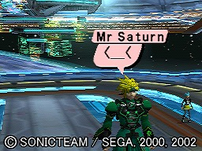
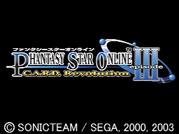
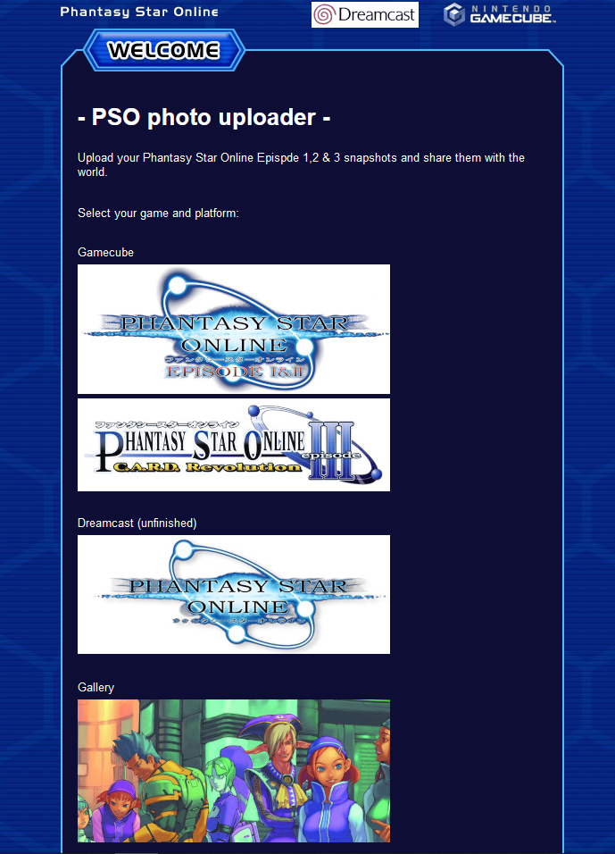
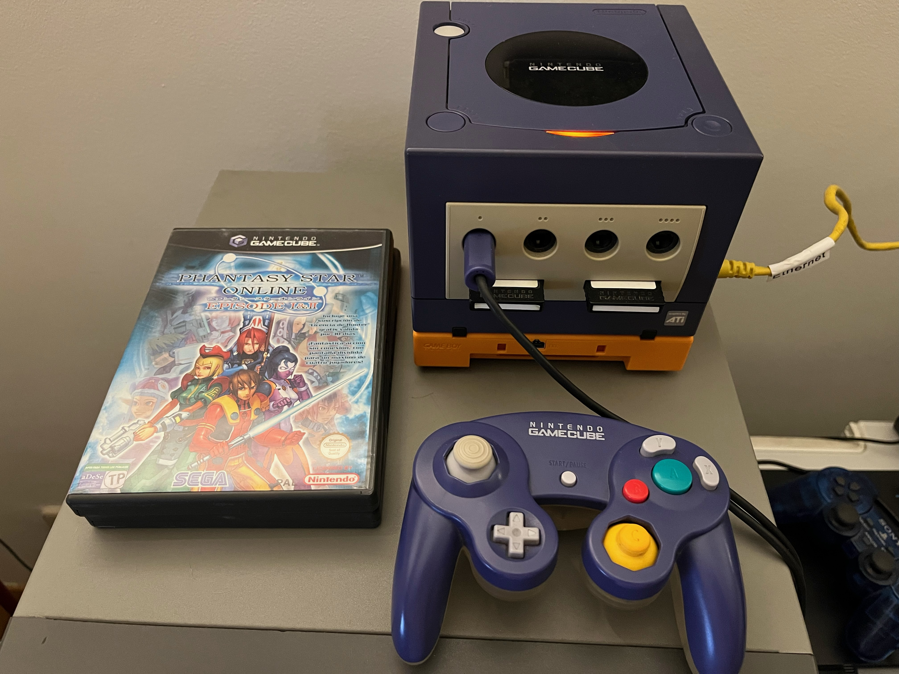

## PSO Photo Uploader

This is a simple node js app that sets up and exposes a basic HTML4-compliant page that enables Gamecube players of Phantasy Star Online Episode 1&2,3 to upload their in-game snapshots from their memory cards to a modern web server. They can then retrieve them by either snapping the generated png file directly from the server (if they are running it on their own machine) or by accessing a public url in the shape of a generated QR Code in case this is running elsewhere.

### Motivation

This is basically the same thing that good old http://pso.donut-dhs.org did back in the day. Since it appears to be offline (as of August 2024) I decided to create an open source app that replicates its functionality. I've also deployed it for the world to use at http://103.45.245.145:3000

### Sources

- pso.donut-dhs.org: https://web.archive.org/web/20080122060628/http://pso.donut.dhs.org/
- PSO Proxy: https://psoproxy.sourceforge.net/

Special thanks for the image conversion code on PSO Proxy which is still miraculously available.

### Usage

- Clone the repo on your computer, run **npm install** and **node app.js** to launch the app
- The default PORT is 3000 but you can change it to whatever you want directly on app.js
- Launch PSO on your Gamecube, make sure you are able to reach the internet via Modem or BBA.
- Go to Options, Network Configuration and create a new connection profile (no need to overwrite your normal connection settings)
- Set everything to automatic (just keep pressing on **Next**) until you reach the proxy settings page.
- There, set the proxy address as your machine's ip and the selected port you want to use (3000 is the default one), for example:
  - **Address:** 192.168.1.200
  - **Port**: 3000
  - **NOTE**: If you have deployed the server app elsewhere you'll need to set the adress to your hostname.
- Now, go back to the Title Screen and select "Webpage".
- Tap on the Front Page mentioning that you need to buy a Hunter's License to play (🥲)
- If everything is correctly set you should reach the Upload page (see screenshots below)
- Select the Episode (1&2 or 3) from where your snapshot is coming.
- Tap on **Upload snapshot**. If you have a valid snapshot stored on Memory Card B it will be uploaded to the server and you'll be redirected to a page containing said image and a QR code. If you scan that code you can easily download the image on your smartphone as a convenient .png file.

### Example output

### Caveats

- It would be cool to make it work for the Dreamcast versions as well (sadly I don't have a DreamPi to test it with yet).
- The page styling could definitely be prettier too.

### Screenshots

Sorry for the Y2K quality, but these were taken directly from a CRT. They are as authentic as they can be :D

Testing hardware:

