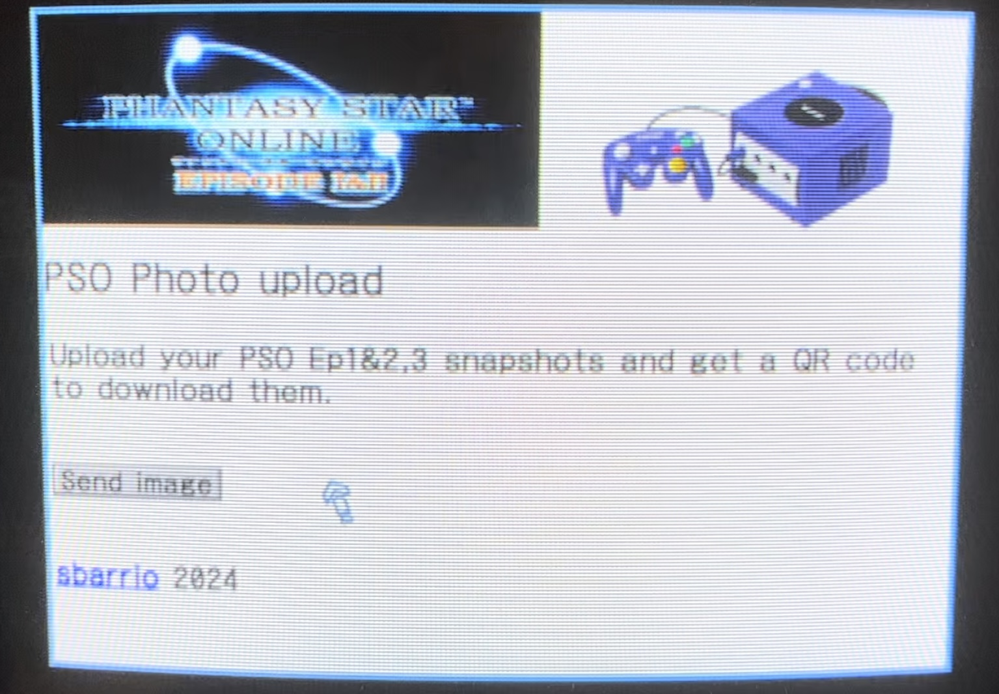
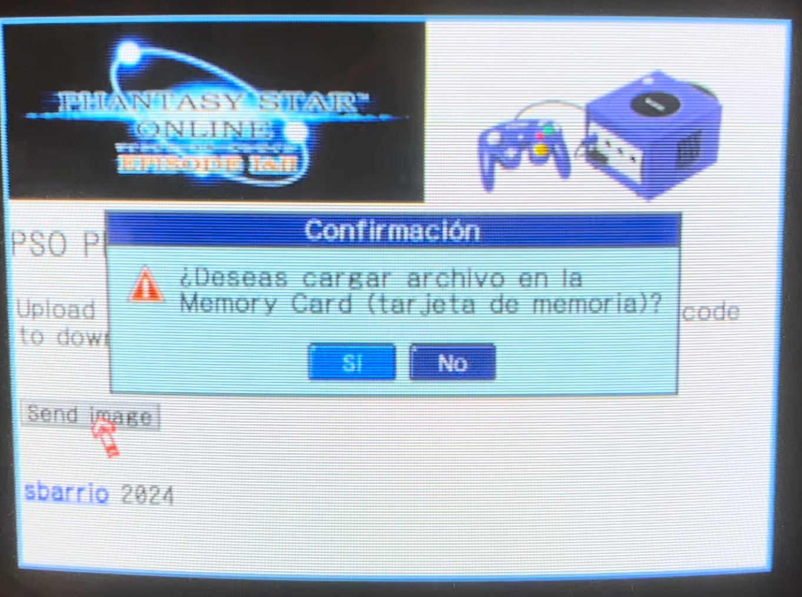
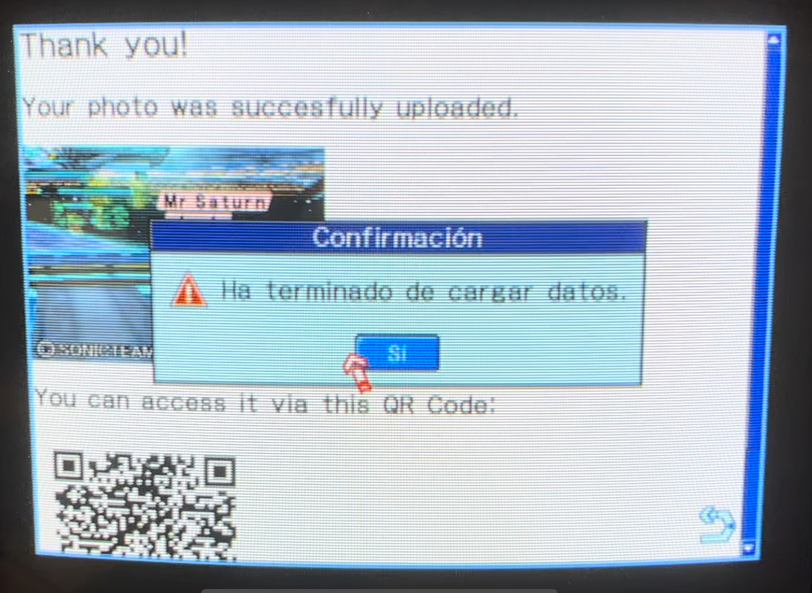
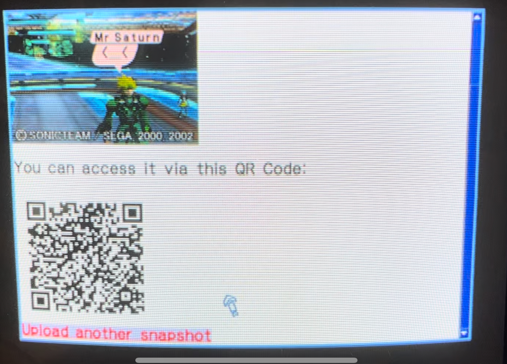

## PSO Photo Uploader

This is a simple node js app that sets up exposes a basic HTML4-compliant page that enables Gamecube players of Phantasy Star Online Episode 1&2 to upload their in-game snapshots from their memory cards to a modern web server. They can then retrieve them by either snapping the generated png file directly from the server (if they are running it on their own machine) or by accessing a public url in the shape of a generated QR Code in case this is running elsewhere.

### Motivation

This is basically the same thing that good old http://pso.donut-dhs.org did back in the day. Since it appears to be offline (as of August 2024) I decided to create an open source app that replicates its functionality in the hopes of me deploying this on a cheap server for everybody to use or at least make it available for somebody to deploy it themselves.

### Sources

- pso.donut-dhs.org: https://web.archive.org/web/20080122060628/http://pso.donut.dhs.org/
- PSO Proxy: https://psoproxy.sourceforge.net/

Special thanks for the image conversion code on PSO Proxy which is still miraculously available.

### Caveats

To make this production ready I would add a periodic task to delete generated files every x minutes, slow enough to allow users to snap their pictures via QR code leisurely but fast enough to avoid bloating the server and consuming too much disk space. The page styling could definitely be prettier.

It would also be cool to make it work for the Dreamcast versions as well (sadly I don't have a DreamPi to test it with yet).

### Example output

### Operation example

Sorry for the Y2K quality, but these were taken from a CRT off-screen. They are as authentic as they can be :D

Testing hardware:

